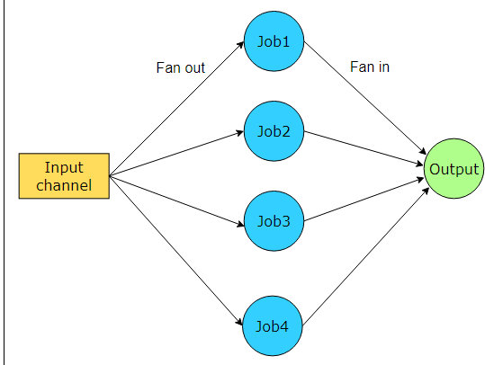

##Fan-In Design Pattern

1. The fan-out/fan-in pattern is a **concurrency design pattern** commonly **used in Go for parallelizing and coordinating concurrent tasks.**

2. It is particularly useful when you have **time-consuming task** than **can be divided into smaller subtasks** *that can be executed concurrently*

3. How it works
    - The pattern consists of two main stages: fan-out and fan-in

    - Fan-out
    
        i. In the fan-out stage, a **single task is divided into multiple smaller subtasks**, which are then **executed concurrently.**

        ii. Each subtask can be **assigned to a seperate goroutine**(lightweight concurrent thread in go) **to run in parallel.**

        iii. This **stage distributes the workload across multiple goroutines**, **allowing for parallel processing.**

    - Fan-in

        i. In the fan-in stage, **the results or outputs from all the concurrency executing subtasks are collected and combined into a single result.**

        ii. **This stage waits for all the subtasks to complete and aggregates their results**.

        iii. The **fan-in stage can also handle synchronization and coordination between the goroutines to ensure that all results are collected before proceeding.**

Nice reference (need to try out examples): https://www.educative.io/answers/what-is-the-fan-out-fan-in-pattern-in-golang

